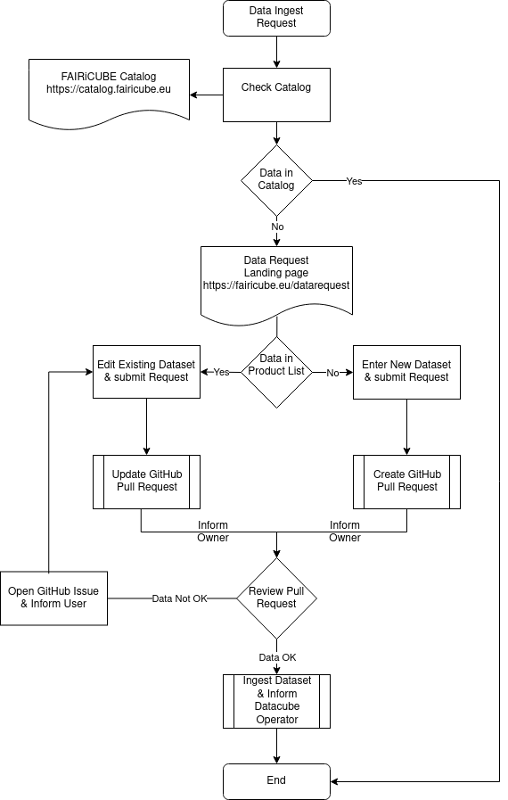
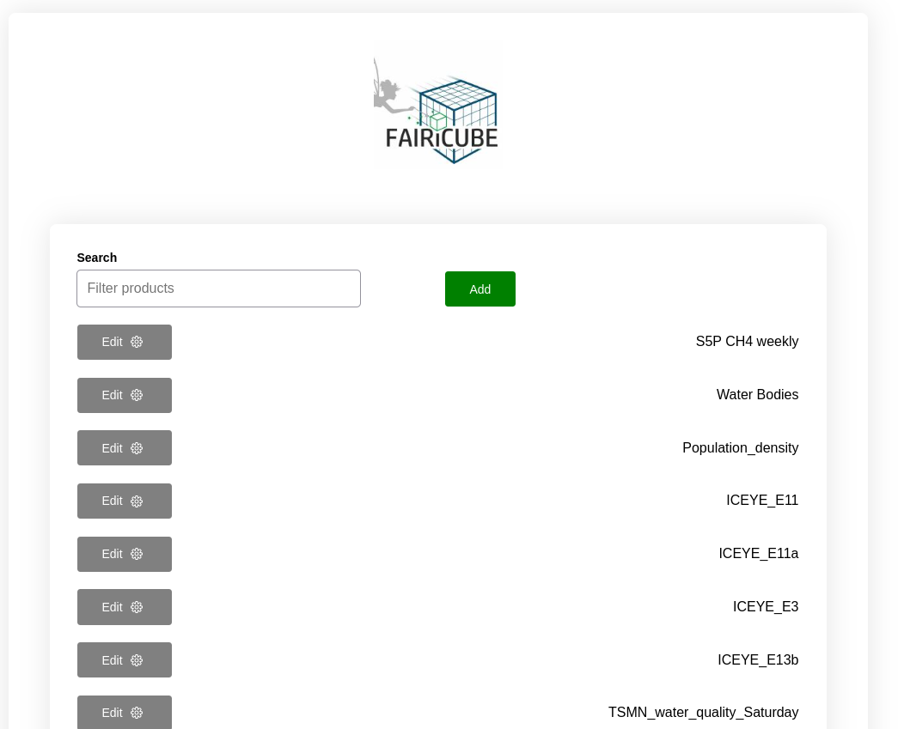
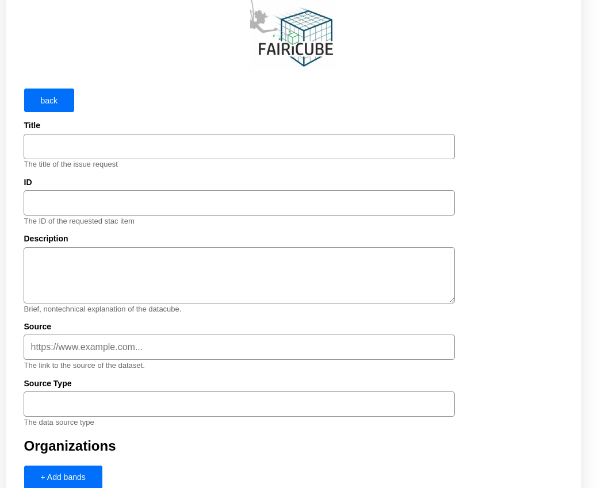
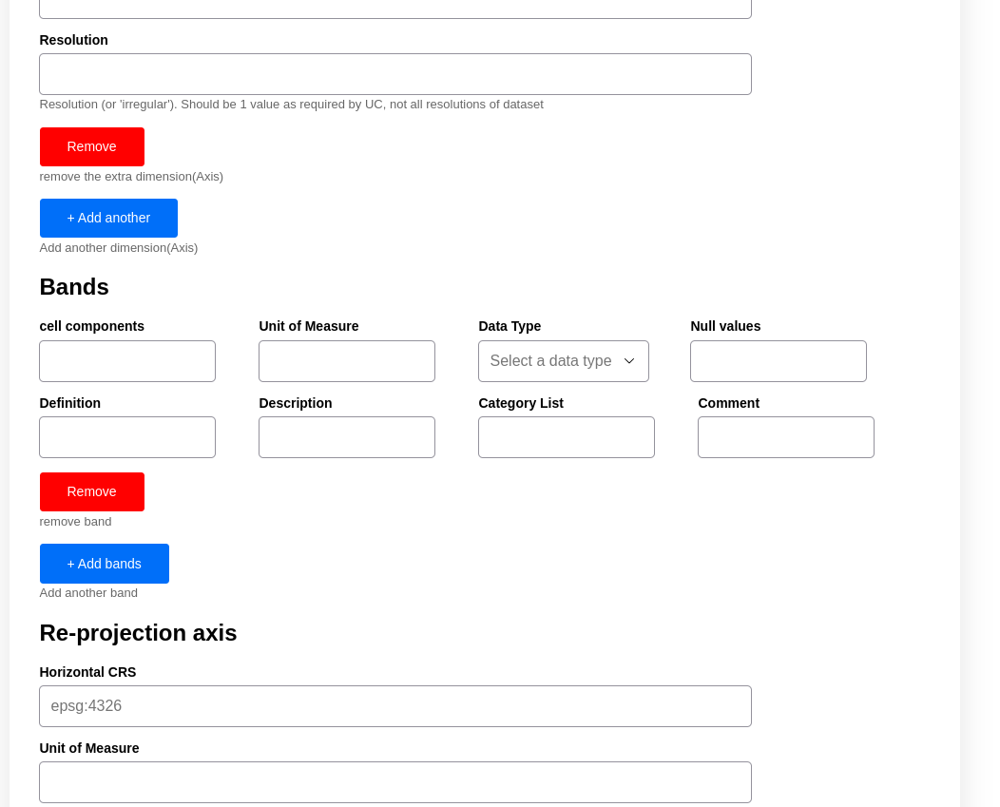
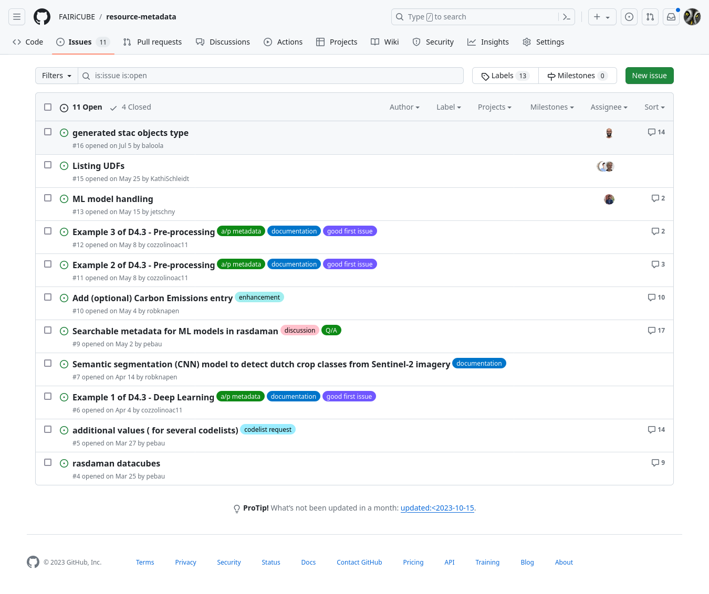
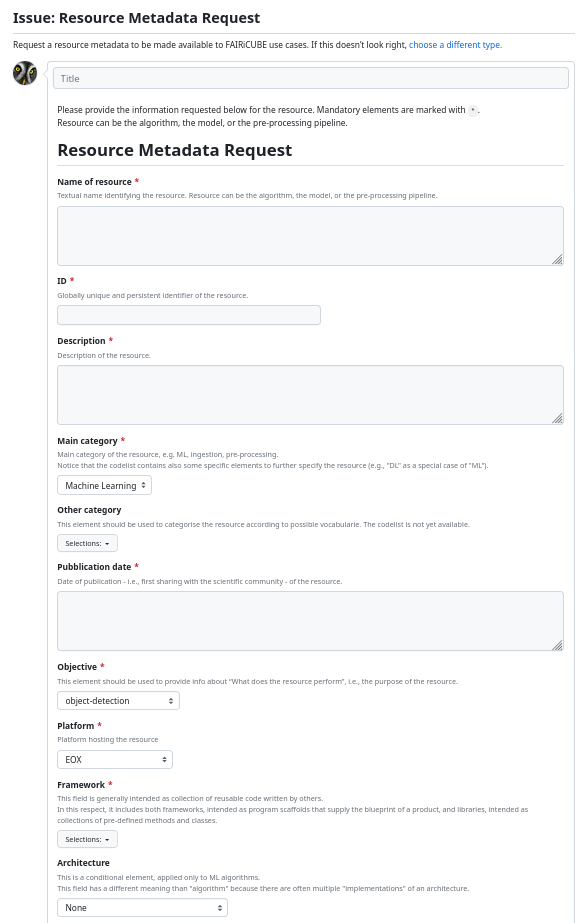
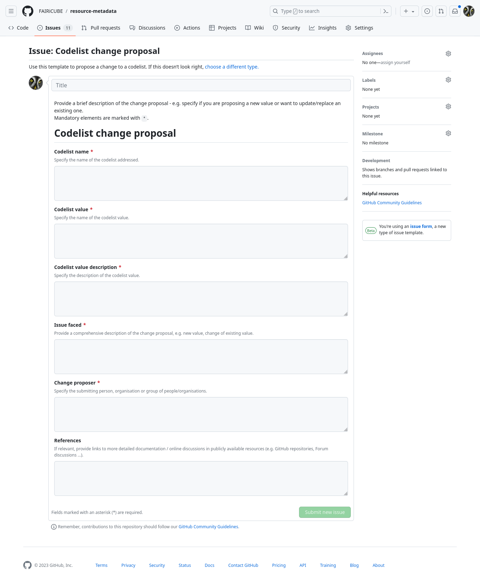

# Adding Datasets to the FAIRiCUBE

The FAIRiCUBE Hub provides access to a wider variety of datasets, processes, and models. These can either be available local or external (federated) to FAIRiCUBE. External datasets are federated from the Euro Data Cube (EDC) or from the EarthServer Federation.
The FAIRiCUBE Catalog holds metadata for datasets as well as processes. Datasets are either local or external ones. Processes are either algorithms provided mainly as Jupyter notebooks, invokable models, or specific deployed services or apps.

If a dataset or a process/analysis resource is not already available in FAIRiCUBE via one of the provided Datastores (e.g., AWS, DIASes, Euro Data Cube, EarthServer Fed., etc.) then a User can issue a Data Request to get the data ingested into FAIRiCUBE.

Two type of request are provided by FAIRiCUBE:

* **data-requests:** Request for data to be made available within FAIRiCUBE Lab.
    * Such a data request can be initiated via a provided WebGUI available at [https://catalog-editor.eoxhub.fairicube.eu/](https://catalog-editor.eoxhub.fairicube.eu/).
* **resource-metadata**: Collect information for processing/analysis resources as well as propose a change to a codelist. [https://github.com/FAIRiCUBE/resource-metadata](https://github.com/FAIRiCUBE/resource-metadata)
    * *Issue resource-metadata:* [https://github.com/FAIRiCUBE/resource-metadata/issues/new?assignees=&labels=&projects=&template=metadata-request.yml](https://github.com/FAIRiCUBE/resource-metadata/issues/new?assignees=&labels=&projects=&template=metadata-request.yml)
    * *Issue codelist change:* [https://github.com/FAIRiCUBE/resource-metadata/issues/new?assignees=&labels=&projects=&template=codelist_change_proposal.yml](https://github.com/FAIRiCUBE/resource-metadata/issues/new?assignees=&labels=&projects=&template=codelist_change_proposal.yml)

In general, before submitting a request, a user wishing to use a specific dataset or resource on the FAIRiCUBE Hub should first take a look at the [FAIRiCUBE Catalog](https://catalog.eoxhub.fairicube.eu/) to see if the dataset or resource is already available and ready to be used.

#### Data Request

In the case a user wants to have a additional dataset added, the user needs to create a data request using the data request WebGUI [https://catalog-editor.eoxhub.fairicube.eu/](https://catalog-editor.eoxhub.fairicube.eu/), which ensures that all required metadata is provided, proper tags are added, and all relevant people are notified. With the submission of the WebGUI form a GitHub Pull Request is issued as a new branch which the user is automatically watching and thus receiving notifications of updates depending on their GitHub notifications configuration.

Any new data request is addressed by the requester together with one of the ingestion handling partners. Any progress, problems, discussions, etc. shall be documented in an GitHub issue associated to the respective Pull Request, so that everybody interested can follow the progress and provide additional feedback or information as necessary.

The following procedure for a **Data Ingestion Request** has been set up and is shown in the Figure below:

The next Figure shows the Data request WebGUI Landing page [Catalog Editor](https://catalog-editor.eoxhub.fairicube.eu/), providing also a listing of available datasets, and allowing for editing of already provided metadata.

The next Figure shows the Entry Form of the Data request WebGUI. Here the necessary metadata has to be provided for each dataset, in order to enable the data ingestion process. 
In the *editing* mode the already provided metadata will be filled into the respective fields.

 

Once all metadata and data requirements are fulfilled and confirmed by the data requester, the ingestion handling partners will perform the merge and the Pull request will be closed. The respective branch in GitHub will also be closed and deleted. Any issues and discussions associated with the Pull Request are still available after the branch has been merged and deleted.

When the merge is done the newly submitted data is available as a STAC item to the STAC Browser. The dynamic catalog using the STAC Browser is currently deployed at [FAIRiCUBE Catalog](https://catalog.eoxhub.fairicube.eu/). The STAC Browser provides additional features like searching, which are not available in the static STAC catalog.

#### Resource-Metadata Request

In case it is not yet listed in the catalog, the user should further consult the resource-metadata GitHub issues [https://github.com/FAIRiCUBE/resource-metadata/issues](https://github.com/FAIRiCUBE/resource-metadata/issues), to check if the dataset is already in a draft request state. In case the dataresource is already listed, the user can directly convert the draft into an issue in the GitHub repository where progress is further tracked.
When the dataset is neither already present in the FAIRiCUBE Catalog nor in the resource-metadata GitHub project, the user should issue a new request utilizing the respective links given above.

To add **new resource-metadata** to the FAIRiCUBE Catalog or request a codelist change the following request procedure has been defined (links provided above):

* The resource-metadata request procedure relies on GitHub, where each request is handled as an issue created by the resource requester, and then addressed together with one of the ingestion handling partners.
* A resource-metadata request issue template has been created to assure that the data requester provides all required information.
* The GitHub issue management is used for problems raised, addressed, and solved pertaining to a specific data request, providing full traceability.
* Once all uncertainties are resolved the GitHub issue is labeled approved, which will trigger the ingestion process.

The next Figure shows the Resource-metadata GitHub Issues page:

The Resource Metadata Request can be reached at: [https://github.com/FAIRiCUBE/resource-metadata/issues/new?assignees=&labels=&projects=&template=metadata-request.yml](https://github.com/FAIRiCUBE/resource-metadata/issues/new?assignees=&labels=&projects=&template=metadata-request.yml)

The next Figure shows the first section of the Resource-metadata GitHub Request page:

#### Codelist Change Request

Following the same logic as for the Resource Metadata Request a **Codelist Change Request** can be issued:

The Codelist change proposal can be reached at:  [https://github.com/FAIRiCUBE/resource-metadata/issues/new?assignees=&labels=&projects=&template=codelist_change_proposal.yml](https://github.com/FAIRiCUBE/resource-metadata/issues/new?assignees=&labels=&projects=&template=codelist_change_proposal.yml).

The next Figure shows the Codelist Change Request page:

