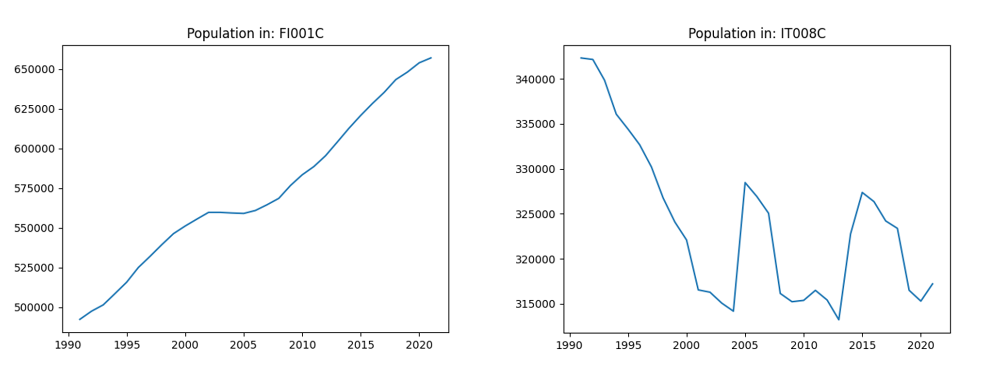
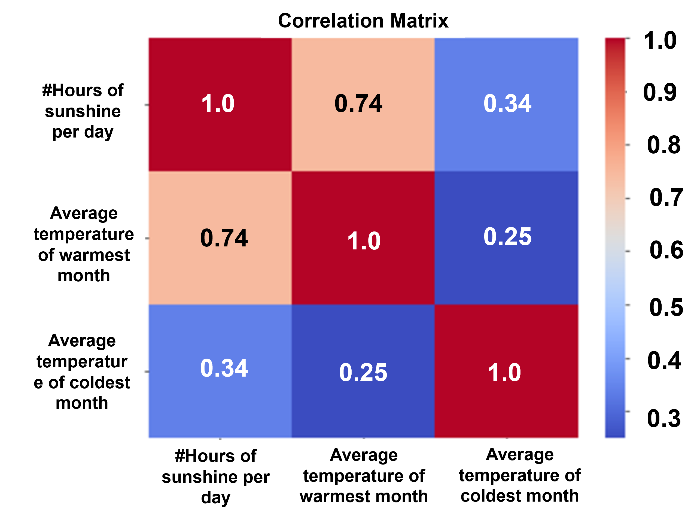

# Urban adaptation to climate change - UC1

The aim of this use case is to provide comprehensive data on urban adaptation to climate change, offering a clear picture of the current situation.

A persistent challenge in developing effective adaptation strategies is the complexity of integrating and analyzing heterogeneous datasets with varying formats and quality. The UC1 approach addresses this issue through two key components: a process to **harmonize diverse datasets into structured data cubes**, and a comprehensive **toolkit for their analysis and presentation**. These tools support UC applications at multiple scales.

At the **European level**, they help identify cities with similar characteristics and analyze how different factors influence their adaptation capacity. At the **local level**, specialized "city cubes" serve specific goals, as demonstrated through collaborations with Luxembourg City on managing invasive plant species and support provided to Vienna city initiatives.

## EU level - City features collection

### Research questions

* What are commonalities of and differences between cities in terms of their situation about climate adaptation considering comparable European data sets from various sources (Copernicus, ESTAT)?  Can we identify groupings of cities with similar conditions with respect to different climate pressures (e.g. heat islands, air quality…) 
* Can we identify the impacts of certain measures in cities? E.g., what does it mean to increase the urban tree cover as requested by European policies?  

### Workflow 

## Data and ingestion

| Dataset name | Description | Link to Metadata
|---|---|---|
| GISCO Urban Audit | Provides harmonized statistical data on quality of life in European cities, including demographics, housing, health, and environment. | https://ec.europa.eu/eurostat/web/gisco/geodata/statistical-units/urban-audit |
| Copernicus DEM | A high-resolution Digital Elevation Model representing Earth's surface, including buildings and vegetation, available in 10m, 30m, and 90m resolutions. | https://doi.org/10.5270/ESA-c5d3d65 |
| Environmental Zones | A classification of Europe into ecological zones based on environmental stratification, supporting biodiversity and land management. | https://sdi.eea.europa.eu/catalogue/idp/api/records/6ef007ab-1fcd-4c4f-bc96-14e8afbcb688 |
| CLMS HRL Imperviousness | Maps the degree of soil sealing (e.g., roads, buildings) across Europe, supporting urban planning and environmental monitoring. | https://land.copernicus.eu/en/products/high-resolution-layer-imperviousness |
| CLMS HRL Tree Cover Density | Provides percentage-based tree cover data across Europe, useful for forest monitoring and carbon accounting. | https://land.copernicus.eu/en/products/high-resolution-layer-tree-cover-density?tab=main |
| Urban Atlas (CLMS) | Detailed land cover and land use data for Functional Urban Areas in Europe, supporting urban planning and policy. | https://doi.org/10.2909/fb4dffa1-6ceb-4cc0-8372-1ed354c285e6 |
| Thermal Comfort Indices (ERA5) | Derived from ERA5 reanalysis, this dataset includes indices like UTCI and MRT to assess human thermal stress in outdoor environments. | https://doi.org/10.24381/cds.553b7518 |
| Eurostat Urban Audit (Socio-economic) | Offers socio-economic indicators for European cities, including data on population, education, employment, and income. | https://ec.europa.eu/eurostat/cache/metadata/EN/urb_esms.htm |

- Land and climate data are harmonised and ingested in a spatial data cube (spatial coordinates are latitude/longitude). Harmonisation consists for example in ensuring that the dimensions all share the same projection and geographical extent.  
- The spatial data cube is used to compute various city indicators. One indicator has one value per city/timestamp.  
- These land- and climate-based indicators are then fed into a city data cube available at https://github.com/FAIRiCUBE/uc1-urban-climate/tree/master/data/city_features_collection
- At the same time, socio-economic data is ingested. Socio-economic data do not have spatially explicit coordinates, but rather they are indexed by the city identifier. Therefore, indicators are directly fed into the city data cube, and derived indicators are computed.  

### Processing steps and ML applications

To make the most out of the Eurostat socio-economic data, we experimented with ML gap filling methods based on feature correlation or on time series (Long Short-Term Memory method). Unfortunately the gaps proved to be too wide to be filled sensibly without hampering the data quality.
#### Gap-filling with bidirectional LSTM
A widely adopted machine learning technique for modeling time series is the Long Short-Term Memory (LSTM) network, a type of Recurrent Neural Network (RNN) designed to learn from sequential data and retain information over long time horizons. An extension of this model, the Bidirectional LSTM (BLSTM), processes data in both forward and backward directions, enhancing its ability to capture temporal dependencies.

In this study, we applied BLSTM models to predict the 'Total Population' indicator using Eurostat data spanning 31 years (1991–2022). Two cities were selected for evaluation:

- Helsinki (FI001C): Exhibits a simple, linear increasing trend.
- Bari (IT008C): Displays a more complex, non-linear pattern.
- 

Each BLSTM model was trained using the first 70% of the time series (approximately 22 years), with a sequence length of 3 (e.g., predicting the value for 2010 using data from 2007–2009). The remaining years were reserved for testing. Training was conducted over 100 epochs.

##### Results
- Helsinki: The model achieved a Mean Absolute Percentage Error (MAPE) of 0.63%, closely matching the actual values due to the linear nature of the time series.
- Bari: Despite a lower MAPE of 0.53%, the predictions did not accurately capture the complex trend, indicating limitations in model generalization for non-linear patterns.

The figure below illustrates the predicted vs. actual values for Helsinki (FI001C) and Bari (IT008C).

##### Limitations
This approach has several constraints:

- Limited Data Points: With only 31 observations, training is insufficient for complex time series. A minimum of 50 data points is recommended for reliable performance.
- City/Indicator Specificity: Each model must be trained individually per city and indicator, which is computationally intensive.
- Zero Data Cities: Cities with no historical data cannot benefit from this method unless a proxy city with similar characteristics is identified—a non-trivial task.
- Applicability: The method is most effective for cities/indicators with 1–5 missing years and regular trends (e.g., linear growth).

Find the BLSTM gap-filling script here: [Python script](https://github.com/FAIRiCUBE/uc1-urban-climate/blob/master/processing/gap_filling/BLSTM_Helsinki.py)

#### Gap-filling with gradient boosting regressor

Some indicators exhibit strong interdependencies. For example, the Proportion of population aged 75 years and over is inherently related to the Total Population. These relationships can be leveraged to estimate missing values using machine learning (ML) regression models.

Regression models learn a function that estimates the value of a target feature based on a set of input features. These models range from simple linear regression to more complex approaches such as ensemble methods and deep learning architectures.
As a demonstration, we implemented a regression model to estimate the Total number of hours of sunshine per day (EN1002V) using the input features 
Average temperature of warmest month – degrees (EN1003V) and Average temperature of coldest month – degrees (EN1004V).
To train the model, we selected 1,673 data points from Eurostat where all three indicators were available. The trained model was then used to gap-fill 299 data points where the two input features were present, but the target feature was missing.

The figure above presents the correlation matrix computed from the 1,673 complete data points. The matrix reveals a positive correlation between the target and input features, particularly between EN1002V and EN1003V, with a correlation coefficient of 0.74. This strong correlation suggests that a regression model could perform well in this context.
Several regression models were trained using 70% of the available data (1,173 data points). Among them, the Gradient Boosting Regressor—an ensemble method based on decision trees—yielded the best performance, with Mean Squared Error (MSE) of 0.48, equivalent to an average error of less than 30 minutes of sunshine per day, and F1 Score of 0.677, indicating promising classification-like performance in a regression context.
The figure below shows the distribution of predicted vs. actual sunshine hours, demonstrating a close alignment between the two.

##### Limitations
While regression models can be effective for gap filling, several limitations must be considered:

- Manual Feature Selection: Each indicator requires a custom model and manually defined input features based on domain knowledge or correlation analysis.
- Insufficient Training Data: Many indicators lack enough complete data points to train a reliable model.

Find the gradient boosting regressor gap-filling script here: [Python script](https://github.com/FAIRiCUBE/uc1-urban-climate/blob/master/processing/gap_filling/Regression_EN1002V.py)

#### Cluster analysis based on Urban Atlas land use classes
To get a general overview of the cities that are similar with respect to land use distribution, clustering can be used. Clustering is a type of Unsupervised Machine Learning tool that aims to put a given data into different clusters, each containing data points that are similar with respect to a set of features.
For the task of clustering cities with respect to land use distribution, we have experimented with three different clustering algorithms:  k-means, Mean-Shift and agglomerative hierarchical clustering (AHC).
##### K-Means Clustering
K-Means is a widely used clustering algorithm that partitions data into K clusters by iteratively assigning points to the nearest cluster center and updating the centers until convergence. The Elbow Method helps determine an optimal K by plotting the inertia (sum of squared distances to cluster centers) for various K values. The "elbow" point indicates diminishing returns in variance reduction. In this study, K = 4 was selected.

##### Mean-Shift Clustering
Mean-Shift identifies clusters by shifting a window toward the mean of points within it, repeating until convergence. Unlike k-means clustering, there is no need to specify the number of clusters in advance. Instead, one has to set a window size (bandwidth), which significantly affects results.
With a bandwidth of 0.25, four clusters were formed, but 93% of cities were grouped into a single cluster, making the method unsuitable for this dataset.

##### Agglomerative Hierarchical Clustering (AHC)
AHC builds a hierarchy of clusters by successively merging the closest pairs of clusters. The user can then select the desired number of clusters from the hierarchy.
We selected 4 clusters for consistency with K-Means.

The figure below shows pairwise combinations of the most relevant features (Artificial surfaces, Agricultural areas and Natural and semi-natural areas) for all three methods. We can see that Mean-Shift produced imbalanced clusters, while K-Means and AHC yielded similar, more meaningful groupings, though AHC showed slight overlap. In conclusion, K-Means provided the most interpretable and balanced clustering for this study.

### Solution(s) 

- Interactive view of the city features collection: 
- Interactive demo clustering analysis: [Jupyter Notebook](https://github.com/FAIRiCUBE/uc1-urban-climate/blob/master/notebooks/demo/cities_clustering_interactive_demo.ipynb)

### Resources 

- [Getting started with FAIRiCube Hub](https://github.com/FAIRiCUBE/uc1-urban-climate/blob/master/notebooks/demo/demo_processing.ipynb)

## Local level: invasive alien plant species

At local level, the focus was on leveraging earth observation data cubes to monitor invasive plant species. These research questions were developed in collaboration with the Environment delegate of Luxembourg City administration:

### Research questions

* Can we identify correlations between plant neophytes’ presence and spatial and environmental factors in urban areas? 
* Can we identify patterns of neophytes spread, and how they affect sensitive areas? 

### Workflow 

### Data and ingestion

Table 2 lists the input data sets used for this application. All the datasets were pre-processed to match the species distribution model requirements. Shadow index and Topographic wetness index were derived from Luxembourg DEM; gridded land cover was obtained by rasterizing the land cover map, which is a vector dataset; Soil acidity, soil nitrogen and temperature were extracted (clipped) from EU wide datasets, reprojected and regridded to match the target CRS (LUREF) at 10m resolution. Most of the preparatory work has been carried out in EOXHub using Python, except for the generation of the Shadow index and Topographic wetness index maps, which was done in QGIS. 

| Dataset name                             | Description                                                                                                                                                                                                      | FAIRiCUBE STAC Catalog link                                                                                                                                                                                     |
| ---- | ---------------------------- | --------------------------- |
| Shadow index                             | The normalized shadow index quantifies the duration of shadow within 10x10m area.                                                                                                                                | [catalog.eoxhub.fairicube.eu/collections/index/items/shadow_index_city_of_luxembourg](https://catalog.eoxhub.fairicube.eu/collections/index/items/shadow_index_city_of_luxembourg?.language=en)                 |
| Topographic wetness index                | The TWI models soil moisture from the digital terrain model based on the size of the upslope contributing area (how much water flows to a point) and the local slope (how likely water is to stay or flow away). | [catalog.eoxhub.fairicube.eu/collections/index/items/wetness_index_city_of_luxembourg](https://catalog.eoxhub.fairicube.eu/collections/index/items/wetness_index_city_of_luxembourg?.language=en)               |
| Average monthly air temperature for 2017 | Average monthly air temperature for 2017 extracted from the Copernicus Climate Data Store. The data were generated using the urban climate model UrbClim.                                                        | [catalog.eoxhub.fairicube.eu/collections/index/items/air_temperature_city_of_luxembourg_2017](https://catalog.eoxhub.fairicube.eu/collections/index/items/air_temperature_city_of_luxembourg_2017?.language=en) |
| Soil acidity                             | Soil Chemical properties based on LUCAS 2009/2012 soil surveys.                                                                                                                                                  | [catalog.eoxhub.fairicube.eu/collections/index/items/soil_ph_city_of_luxembourg](https://catalog.eoxhub.fairicube.eu/collections/index/items/soil_ph_city_of_luxembourg?.language=en)                           |
| Soil Nitrogen                            | Soil Chemical properties based on LUCAS 2009/2012 soil surveys.                                                                                                                                                  | [catalog.eoxhub.fairicube.eu/collections/index/items/soil_nitrogen_city_of_luxembourg](https://catalog.eoxhub.fairicube.eu/collections/index/items/soil_nitrogen_city_of_luxembourg?.language=e)                |
| Land cover                               | Land Cover of the City of Luxembourg                                                                                                                                                                             | [catalog.eoxhub.fairicube.eu/collections/index/items/land_cover_city_of_luxembourg](https://catalog.eoxhub.fairicube.eu/collections/index/items/land_cover_city_of_luxembourg?.language=en)                     |

### Processing steps and ML applications

TODO

### Solution(s) 

TODO

### Resources 

An example Jupyter Notebook is provided by UC1: [Getting started with FAIRiCube Hub](https://github.com/FAIRiCUBE/uc1-urban-climate/blob/master/notebooks/demo/demo_processing.ipynb)

## Partners

space4environment and Stiftelsen Norsk Institutt for Luftforskning, Norwegian Institute for Air Research.

