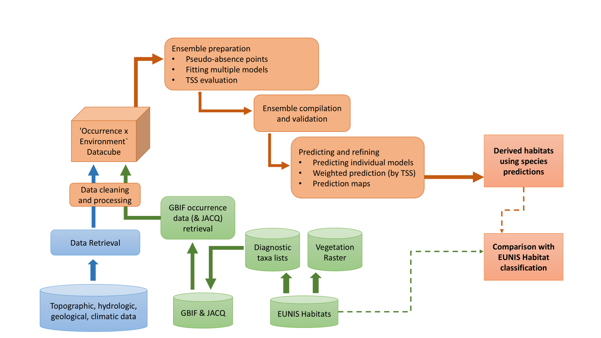
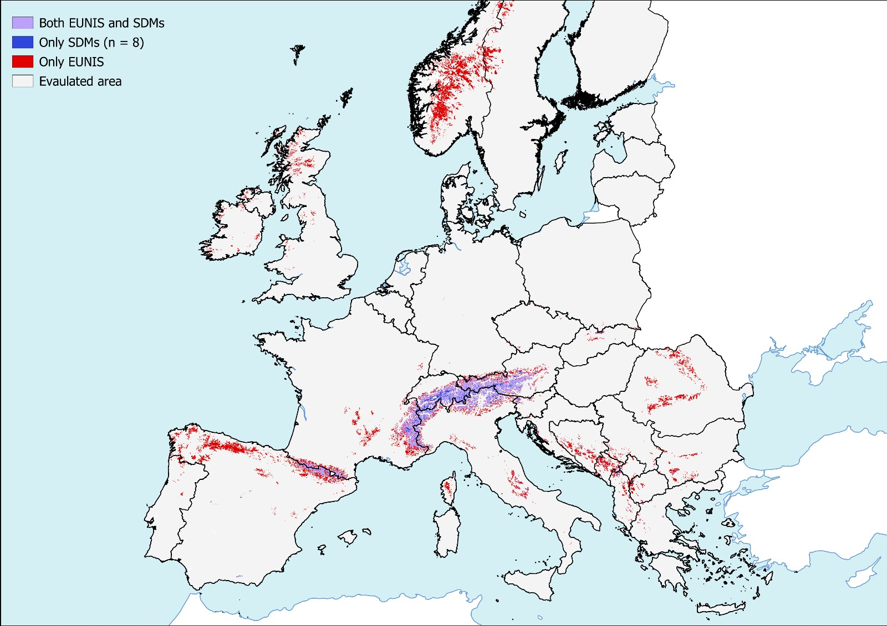
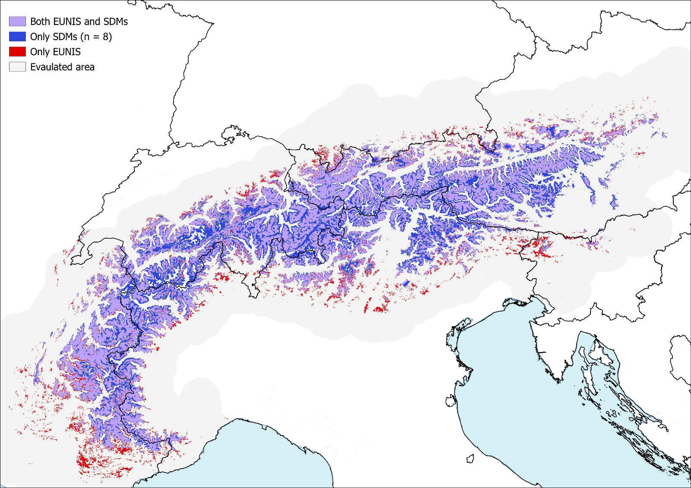

# UC5 – Validation of Phytosociological Methods through Occurrence Cubes

## Introduction

Use Case 5 investigates how integrating species occurrence data with environmental variables can improve habitat mapping accuracy across Europe. A central focus is the exploration of the usefulness and reliability of GBIF data—particularly data from citizen science initiatives and museum collections—which are often overlooked or underrepresented in traditional ecological modelling efforts.

By leveraging occurrence records from the Global Biodiversity Information Facility (GBIF)—spanning scientific publications, citizen-contributed observations, and curated museum specimens—Use Case 5 evaluates how these diverse data sources can enhance habitat classification methods. This work challenges conventional modelling approaches by explicitly incorporating non-traditional data into machine learning (ML) models, assessing how well they align with and refine existing habitat maps, such as those defined by the European Nature Information System (EUNIS).

## Research Questions

1. Which environmental factors influence the distribution and community formation of plant species in European habitats (S22)?
2. Can integrating species occurrence data (e.g., GBIF) and environmental factors retrieved from EO sources improve habitat prediction accuracy, especially within the EUNIS system?
3. How do the predictions of species distribution compare with existing habitat maps, and where do discrepancies arise?

## Workflow

### Short Summary of UC5 Workflow

The UC5 workflow begins with retrieving occurrence data for diagnostic species of the EUNIS Habitat S22 from GBIF, alongside environmental and topographical data from various Earth Observation (EO) sources. The data are pre-processed—filtered, cleaned, and structured into occurrence **data cubes**. To address the presence-only nature of GBIF data, **pseudo-absence points** are generated using a disc-buffer method and merged with presence data to form complete datasets for modelling.

Species distribution models are then developed using **ensemble ML techniques**. Predictions for the eight main species of the study habitat (S22) are aggregated and validated using vegetation plots from **EVA**. Lastly, the outputs are evaluated against the **EUNIS habitat probability map**.

### 1) Data retrieval

Occurrence data for the eight main diagnostic species of Habitat S22 are retrieved from **GBIF**, including herbarium collections, citizen science observations, and biodiversity surveys with spatial/temporal coordinates. Environmental variables are obtained from EO sources including **Copernicus**, **CHELSA Bioclim**, and **WorldClim**. These provide climatic and topographic variables relevant for habitat modelling (e.g., temperature, precipitation, elevation, slope, TWI, HLI, TPI, aridity index).

Data ingestion is carried out locally via APIs rather than through the FAIRiCUBE infrastructure. The temporal range spans **1980–2024**, focusing on spring and summer months.

### 2) Environmental and species data filtering

Preprocessing removes duplicate entries; records with uncertain taxonomy; high coordinate uncertainty (> 500 m); and incorrect/missing coordinates—ensuring that the remaining data better represent species’ true distributions.

### 3) Processing steps and ML applications

- **Data cube integration:** Cleaned species occurrence data are integrated with environmental variables to create **data cubes** that preserve spatial and temporal relationships. These cubes are the primary inputs to the ML models.

- **Pseudo-absence generation:** Pseudo-absence points are generated using a buffer-based random sampling method with a **100 m radius**. Points are sampled outside the buffered presence zones, improving class balance.

- **Ensemble modelling:** Species distributions are predicted with an ensemble combining **GLM**, **GAM**, and **Random Forest**. Predictions are produced at two resolutions: **1 km** (Europe-wide) and **100 m** (Alpine region). Models are trained on **90%** of data and evaluated using **True Skill Statistic (TSS)** with **10-fold** cross-validation stratified by presence–absence. Individual predictions are combined via **weighted averaging** proportional to each model’s TSS. The resulting species predictions are then aggregated into a **Habitat S22** distribution map.

- **Validation with EVA data:** Predictions are validated using the **EUNIS-ESy** habitat distribution maps derived from **EVA** at **1 km** resolution.

- **Comparison with EUNIS maps:** Predicted distributions (1 km, 100 m) are compared to the existing **EUNIS probability map** for Habitat S22 to assess discrepancies and validate the alternative approach.

#### UC5 outputs vs EUNIS S22 (examples)

| 1 km resolution | 100 m resolution |
|-----------------|----------------|
|  |  |

## Solutions

Following the workflow above, the use case produces refined habitat distribution predictions that better reflect plant distribution in relation to environmental drivers. Outputs include scripts to:

- Build **data cubes** integrating species occurrence and environmental data
- Train **predictive models** for habitat distribution mapping

These outputs are openly available for reproducibility and further application in biodiversity monitoring, conservation, and museum collections curation.

## Resources

### Data sources

- Species occurrence datasets: **GBIF** ([https://www.gbif.org](https://www.gbif.org))
- Environmental data: **Copernicus**, **CHELSA Bioclim**, **WorldClim**
- [**EUNIS** habitat classification system (Habitat S22)](https://sdi.eea.europa.eu/data/1f8814c7-eb8b-4674-9955-1ebf485cfc57)

### Software and tools

- **R** ([https://www.r-project.org/](https://www.r-project.org/))
- [User-friendly R script](https://github.com/FAIRiCUBE/uc5-occurence-cubes/tree/main/user-friendly-script) for:
  - GBIF data retrieval and preprocessing
  - Data cube creation
  - Pseudo-absence generation
  - Ensemble modelling
  - Outputs comparison

### Published resources

- [Distribution predictions of diagnostic species of the Habitat S22 (Zenodo UC5 outputs publication)](https://zenodo.org/records/17037266)
- [Poster presented at the GDDS event (UC5 Poster)](https://zenodo.org/records/16271251)
