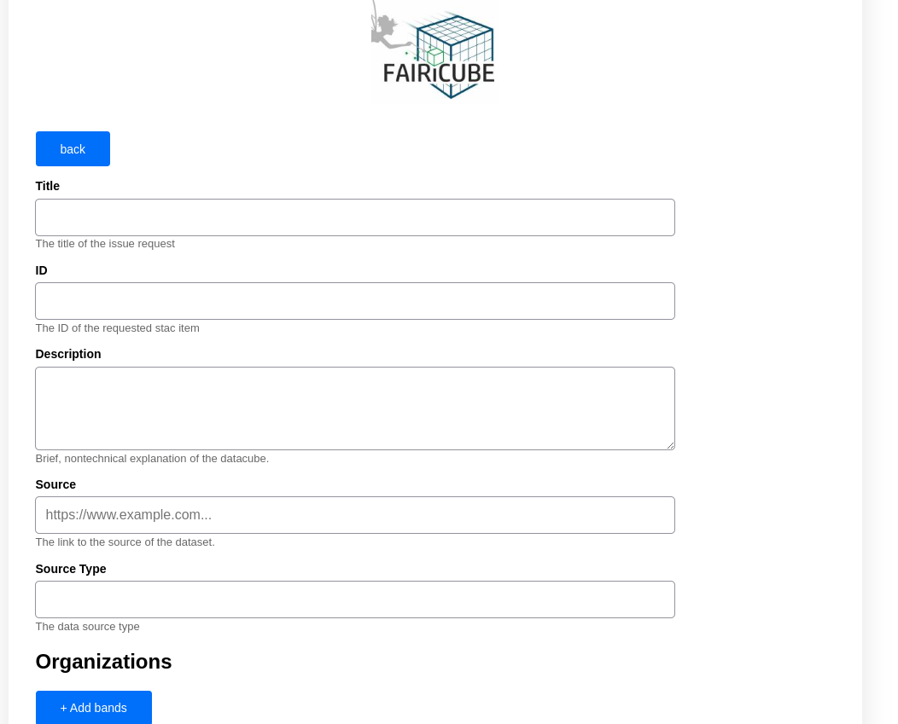
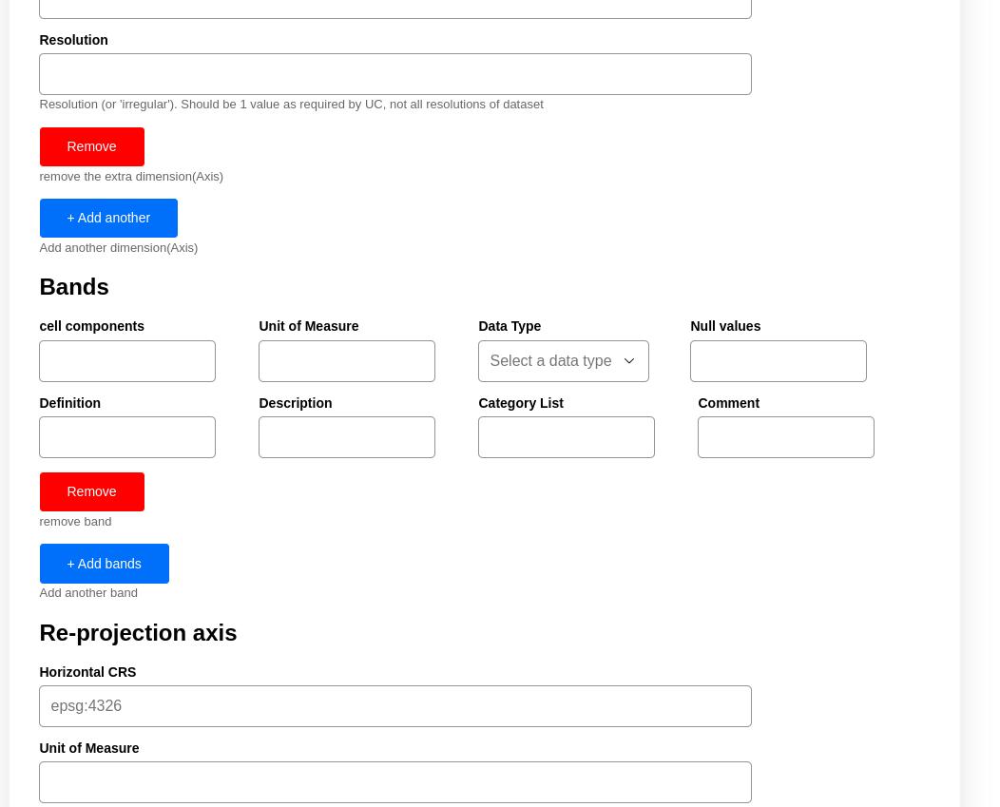

# Adding Datasets to the FAIRiCUBE

The FAIRiCUBE Hub provides access to a wider variety of datasets, processes, and models. These can either be available local or external (federated) to FAIRiCUBE. External datasets are federated from the Euro Data Cube (EDC) or from the EarthServer Federation.
The FAIRiCUBE Catalog holds metadata for datasets as well as processes. Datasets are either local or external ones. Processes are either algorithms provided mainly as Jupyter notebooks, invokable models, or specific deployed services or apps.

For any Storage related questions consult the [Storage Section](https://fairicube.readthedocs.io/en/latest/user_guide/storage/).

If a dataset is not already available in FAIRiCUBE via one of the provided Datastores (e.g., AWS, DIASes, Euro Data Cube, EarthServer Fed., etc.) then a User can issue a Data Request to get the data ingested into FAIRiCUBE.

## Data Request

In the case a user wants to have a additional dataset added, the user needs to create a data request using the data request WebGUI [https://catalog-editor.eoxhub.fairicube.eu/](https://catalog-editor.eoxhub.fairicube.eu/), which ensures that all required metadata is provided, proper tags are added, and all relevant people are notified. With the submission of the WebGUI form a GitHub Pull Request is issued as a new branch which the user is automatically watching and thus receiving notifications of updates depending on their GitHub notifications configuration.

Any new data request is addressed by the requester together with one of the ingestion handling partners. Any progress, problems, discussions, etc. shall be documented in an GitHub issue associated to the respective Pull Request, so that everybody interested can follow the progress and provide additional feedback or information as necessary.

The following procedure for a **Data Ingestion Request** has been set up and is shown in the Figure below:

The next Figure shows the Data request WebGUI Landing page [Catalog Editor](https://catalog-editor.eoxhub.fairicube.eu/), providing also a listing of available datasets, and allowing for editing of already provided metadata.

The next Figure shows the Entry Form of the Data request WebGUI. Here the necessary metadata has to be provided for each dataset, in order to enable the data ingestion process. 
In the *editing* mode the already provided metadata will be filled into the respective fields.

 

Once all metadata and data requirements are fulfilled and confirmed by the data requester, the ingestion handling partners will perform the merge and the Pull request will be closed. The respective branch in GitHub will also be closed and deleted. Any issues and discussions associated with the Pull Request are still available after the branch has been merged and deleted.

When the merge is done the newly submitted data is available as a STAC item to the STAC Browser. The dynamic catalog using the STAC Browser is currently deployed at [FAIRiCUBE Catalog](https://catalog.eoxhub.fairicube.eu/). The STAC Browser provides additional features like searching, which are not available in the static STAC catalog.

