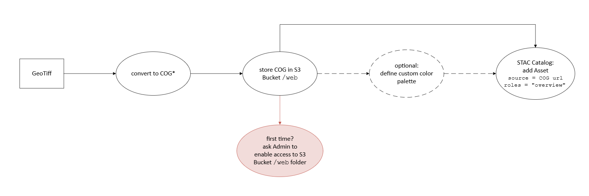
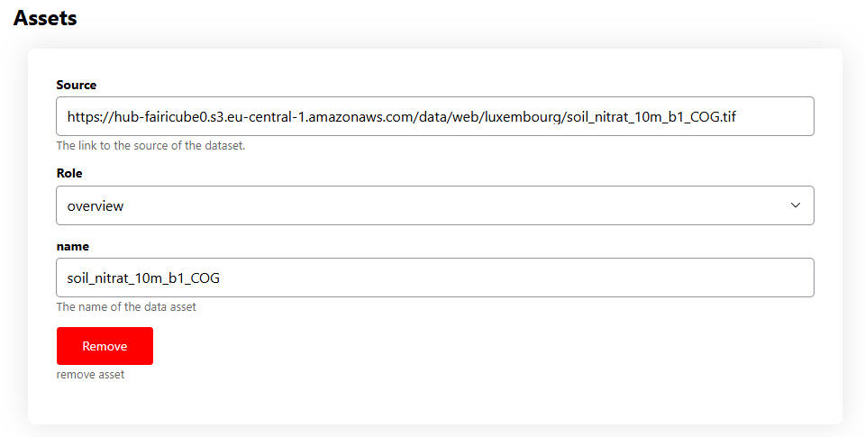

# FAIRiCUBE Web Map 
FAIRiCUBEvis is a web map to display Cloud Optimized GeoTiff files directly from cloud storage. Access it [here](link) In FAIRiCUBE, it is used to visualize datasets ingested in the [FAIRiCUBE Object Storage](https://fairicube.readthedocs.io/en/latest/user_guide/storage/).
FAIRiCUBEvis can be used to present input data and results publicly. In combination with STAC Catalog, it is a quick way to get an idea of a dataset before using it.
To view the map, just visit [vis.fairicube.eu](https://vis.fairicube.eu/). If you want to add your data to the map, follow the guide [](how_to_share).

Features:
* Display COGs from cloud storage (no server in between)
* Integrated with the STAC Catalog!
* Optional: define custom color palettes
* Simple data visualization pipeline


## Link to STAC Catalog
TODO

(how_to_share)=
## How to share your data
Here an overview of the data visualization pipeline.
Note: this guide is developed for FAIRiCUBE, which uses AWS S3 Buckets for Object Storage. In principle, other Cloud Services work as well but they have not been tested.



There are three steps:
* enable public access to a folder within your S3 Bucket
* convert your GeoTiff in COG format
* create a STAC Record for your dataset with a link to the COG file
Additionally, it is also possible to define a custom color scheme. Otherwise, the dataset will be rendered using the default color palettes.

### Enable public access to S3 Bucket
An user with admin privileges can enable public access to selected files or folders within your S3 bucket. We recommend creating and enabling public access to a folder `/web`. You will store all COGs for visualization there.

For more information on enabling public access in AWS S3 buckets, visit [this guide on AWS website](https://repost.aws/knowledge-center/read-access-objects-s3-bucket).

### Create the COG overview

For optimal performance we recommend the COG file to follow these specifics:
* Coordinate Reference System: EPSG:3857
* Tiling scheme GoogleMapsCompatible
* NoData value either 0 or -1. 

Note: it is possible to set any value for NoData, but depending on the selected Color Map, NoData may be non-transparent on the map.
Additionally it is recommended to have a metadata file (PAM auxiliary xml file) in the same folder of the COG. This file is used by the web map for colorization.

The Python script [tif_to_COG_web.py](https://github.com/FAIRiCUBE/common-code/blob/2c6e1ebbace86459894ff0c449bfa73b63cffe60/fromTIFF_to_COG/tif_to_COG_web.py) from FAIRiCUBE' `common-code` repository creates a COG file conforming to the above specifics.
Example usage (within your EOX JupyterLab workspace): 
```
python tif_to_COG_web.py path/to/input_file.tif -o path/to/web/input_file_COG.tif

```
Take note of the public URL of the output file. It should have the following structure `https://<bucket-name>.s3.eu-central-1.amazonaws.com/path/tp/web/<overview_filename>.tif`.

### Edit STAC metadata
Once the dataset overview is in place, you have to add it to the dataset' STAC record: in the [Catalog Editor](https://catalog-editor.eoxhub.fairicube.eu/), open (or create) the STAC record, and add a new Asset for the dataset overview. In the Role drop-down, choose `overview`.

Once merged, the STAC Record will show a link to the web map.

### Custom color maps
FAIRiCUBEvis has three built-in color maps to choose from. If your dataset requires a different color map, there are two ways to define a custom color map:
* using [D3 color scales](https://d3js.org/d3-scale-chromatic)
* using a gdal-like color map

#### d3 color scales

In the same folder of the you dataset overview `dataset_COG.tif`, add a file with the same name of the overview file and extension `.colorpalette.txt`.. The content of the file is
```
d3.somecolorscale

```
where `somecolorscale` is one of `d3js.org` color scales. For example `interpolateBlues`.
Available color scales:
* Categorical schemes: https://d3js.org/d3-scale-chromatic/categorical
* Cyclical schemes: https://d3js.org/d3-scale-chromatic/cyclical
* Diverging schemes: https://d3js.org/d3-scale-chromatic/diverging
* Sequential schemes: https://d3js.org/d3-scale-chromatic/sequential

#### gdal-like color map

For even more control on the color map (e.g. in case of a non-linear color map), add a file with the same name of the overview file and extension `.gdaldemrgb`.
Each line of the color map has the format `upper_threshold,r,g,b,alpha`. For example:
```
0.183,247,251,255,255
0.191,226,237,248,255
0.196,205,224,241,255
0.200,175,209,231,255
0.205,137,190,220,255
0.209,96,166,210,255
0.214,62,142,196,255
0.222,34,114,181,255
0.242,10,84,158,255
inf,8,48,107,255

```
Note: You can generate the color map with QGIS.

## How to use the web map
TODO
