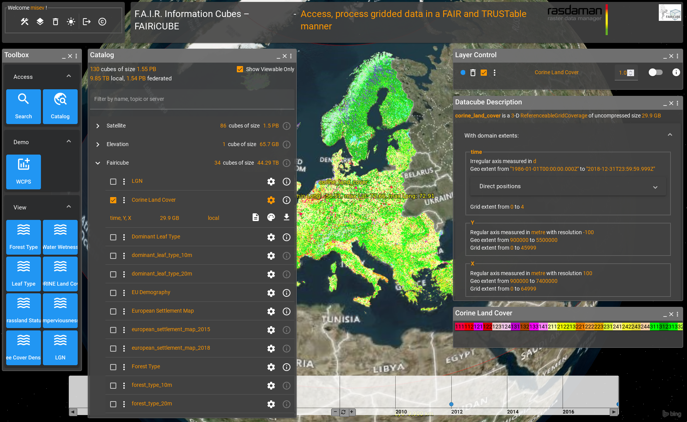
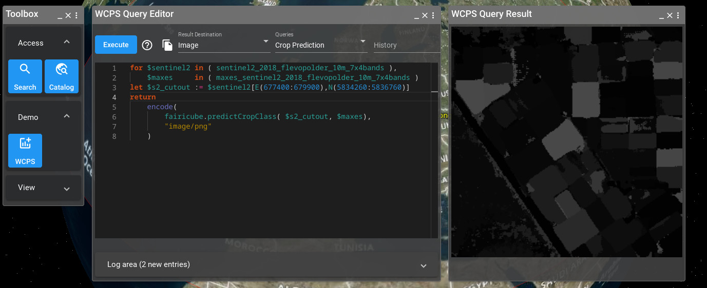
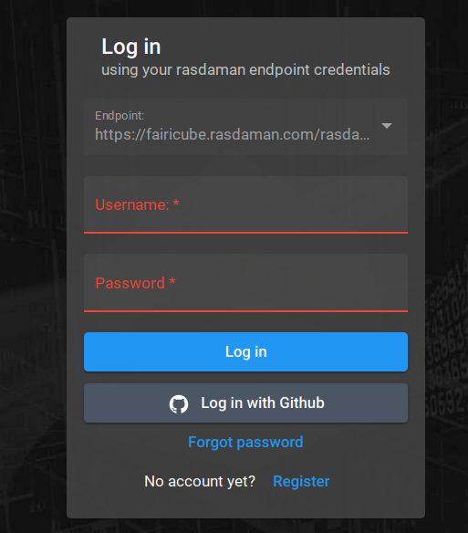

# FAIRiCUBE Rasdaman Datacubes

[rasdaman](https://rasdaman.org/) is a vertically-integrated solution for
managing and providing access via standardized API to spatio-temporal datacubes
of any size and dimensions. Out of the box it provides support for the latest
OGC datacube standards, including WCS 2.1, WCPS 1.0, WMS 1.3, and WMTS 1.0,
as well as experimental support for OGC OAPI-Coverages and openEO.

Through these API, datacubes can be filtered, subsetted along any axes,
processed and analyzed, and finally results can be exported in a variety of 2D
formats (GeoTIFF, PNG, JPEG, etc) as well as more general nD formats such as
netCDF and JSON.

Full documentation of all capabilities of rasdaman can be found on the dedicated
[rasdaman documentation](https://doc.rasdaman.org/). This section documents a
subset of the features most relevant for FAIRiCUBE partners and users.

The [rasdaman FAIRiCUBE webpage](https://fairicube.rasdaman.com/) aggregates the
most important ways to access the rasdaman service, thereby serving as an entry
point for users. There are several clients available out of the box in the
browser.

## Web Coverage Service (WCS)

The OGC Web Coverage Service (WCS) standard defines support for modeling and
retrieval of geospatial data as coverages (e.g. sensor, image, or statistics
data). This section provides a very high-level overview; check the
[rasdaman documentation](https://doc.rasdaman.org/11_cheatsheets.html#wcs) for
further details.

WCS consists of a Core specification for basic operation support with regards to
coverage discovery and retreival with three fundamental operations:

- *GetCapabilities* - returns overal service information and a list of available
   coverages

- *DescribeCoverage* - detailed description of a specific coverage

- *GetCoverage* - retreive a whole coverage, or arbitrarily restricted on any of
   its axes whether by new lower/upper bounds (*trimming*) or at a single index
   (*slicing*)

Various extension specifications define optional capabilities that a service
could provide on offered coverage objects: data import, selecting and combining
coverage bands, scaling (resampling) data, reprojecting to a different CRS,
processing and analytics, etc. Processing and analytics is the topic of the
next section.

## Web Coverage Processing Service (WCPS)

The WCS Processing extension enables advanced analytics on coverages through Web
Coverage Processing Service (WCPS) queries. For example, to calculate the
average on a subset of a coverage named AvgLandTemp:

[https://ows.rasdaman.org/rasdaman/ows?service=WCS&version=2.0.1&request=ProcessCoverages&query=for $c in (AvgLandTemp) return avg($c[Lon(-90.0:85.3), ansi("2014-10-01")])](https://ows.rasdaman.org/rasdaman/ows?service=WCS&version=2.0.1&request=ProcessCoverages&query=for%20%24c%20in%20%28AvgLandTemp%29%20return%20avg%28%24c%5BLon%28-90.0%3A85.3%29%2C%20ansi%28%222014-10-01%22%29%5D%29%20)

Note that the query part (following the `&query=` parameter in the URL) needs
to be URL-encoded because it may contain characters that are not allowed in URLs.
This can be done online, e.g. with this [URLEncoder](https://www.urlencoder.io/),
or one can use a tool such as curl that does it automatically:

    curl 'https://ows.rasdaman.org/rasdaman/ows?service=WCS&version=2.0.1&request=ProcessCoverages' \
         -d 'query=for $c in (AvgLandTemp) return avg($c[Lon(-90.0:85.3), ansi("2014-10-01")])'

Check the
[rasdaman documentation](https://doc.rasdaman.org/11_cheatsheets.html#wcps) for 
an overview of WCPS queries.

## Web Map Service (WMS)

The OGC Web Map Service (WMS) standard defines map portrayal on geo-spatial
data. In rasdaman, a WMS service can be enabled on any coverage, including 3-D
or higher dimensional; the latest 1.3.0 version is supported.

rasdaman supports two operations: GetCapabilities, GetMap from the standard. We
will not go into the details as users do not normally hand-write WMS requests,
but let a client tool or library generate them instead.

## Datacubes Dashboard

The [rasdaman dashboard](https://fairicube.rasdaman.com/rasdaman-dashboard)
provides a custom tailored user interface through which one can search the 
available datacubes, run various prepared or freely written WCPS queries and 
visualize datacubes on a globe (see Figures below).

|  | 
|:--:| 
| *The Corine Land Cover datacube visualized on the globe, with datacube description and a legend.* |

|  | 
|:--:| 
| *This figure shows executing a WCPS query in the WCPS query editor and showing the result.* |

The dashboard provides anonymous access, which allows to see the available
datacubes and see information about them. To visualize, execute queries and
download data it is necessary to login. Users can login either with a valid
username and password, or through their GitHub account if it's been authorized
by the administrator of the rasdaman service.

|  | 
|:--:| 
| *Dashboard login page.* |

## OGC Web Services Client

The [rasdaman WSClient](https://fairicube.rasdaman.com/rasdaman/ows) is
designed more closely to cover the features of the supported OGC Web Services:
WCS for datacube download and processing with WCPS queries via the Processing
extension, as well as WMS/WMTS for datacube visualization.

For more details on the features and interface check the 
[official documentation](https://doc.rasdaman.org/11_cheatsheets.html#rasdaman-wsclient).

|  | 
|:--:| 
| *rasdaman ows client.* |

## Python WCS and WCPS Clients

The following two Python libraries make it easy to access and query datacubes in rasdaman for Python developers:

- WCS python library ([GitHub repo](https://github.com/rasdaman/wcs-python-client), [documentation](https://rasdaman.github.io/wcs-python-client/)) allows to extract information about datacubes: available datacubes, their bounding box/axes, range type, metadata, etc.
- WCPS python library ([GitHub repo](https://github.com/rasdaman/wcps-python-client), [documentation](https://rasdaman.github.io/wcps-python-client/)) allows to dynamically build WCPS queries and execute on a WCPS server.

## Further Clients

As datacube access is provided via standardized API, there's many
different clients that can access the data in rasdaman. The
[rasdaman documentation](https://doc.rasdaman.org/11_cheatsheets.html#clients)
lists many of these, often with guidelines on how to get started with each.